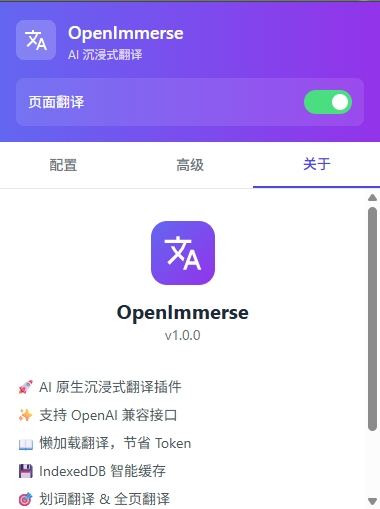
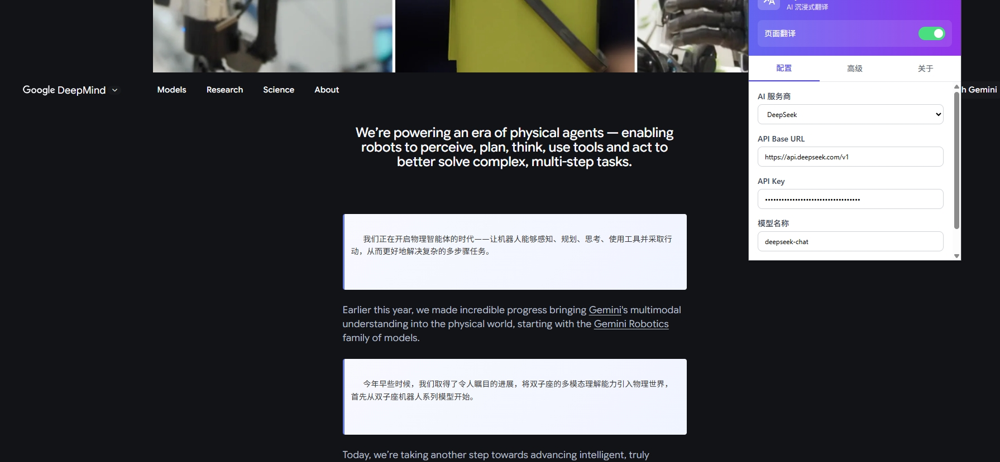

# OpenImmerse

中文 | [English](./README_EN.md)

AI 原生沉浸式翻译 Chrome 插件 - 支持 OpenAI 兼容接口的沉浸式翻译工具

## ✨ 特性

- 🚀 **专注 AI 翻译** - 支持 OpenAI、DeepSeek、Azure、Ollama 等 OpenAI 兼容接口
- 📖 **懒加载翻译** - 仅翻译可视区域，节省 Token，避免 429 错误
- 💾 **智能缓存** - IndexedDB 本地缓存，避免重复翻译
- 🎯 **划词翻译** - 选中文本即可快速翻译
- ⚡ **流式输出** - 实时显示翻译结果，打字机效果
- 🎨 **Shadow DOM** - 样式隔离，不影响原网页

## 功能界面示意图




## 🛠️ 技术栈

- **Core:** React + TypeScript + Vite
- **Extension:** Manifest V3
- **State:** Zustand
- **UI:** Shadow DOM + Tailwind CSS
- **Storage:** chrome.storage.local + IndexedDB

## 📦 安装

### 开发模式

```bash
# 安装依赖
npm install

# 开发构建 (watch mode)
npm run dev

# 生产构建
npm run build
```

### 加载插件

1. 打开 Chrome，访问 `chrome://extensions/`
2. 开启「开发者模式」
3. 点击「加载已解压的扩展程序」
4. 选择项目的 `dist` 目录

## ⚙️ 配置

1. 点击插件图标打开配置面板
2. 选择 AI 服务商 (OpenAI / DeepSeek / Azure / Ollama / 自定义)
3. 填写 API Base URL 和 API Key
4. 选择模型名称
5. 点击「测试连接」验证配置

### 支持的服务商

| 服务商 | Base URL | 示例模型 |
|--------|----------|----------|
| OpenAI | https://api.openai.com/v1 | gpt-4o-mini |
| DeepSeek | https://api.deepseek.com/v1 | deepseek-chat |
| Azure | https://YOUR_RESOURCE.openai.azure.com | gpt-4 |
| Ollama | http://localhost:11434/v1 | llama2 |

## 🎮 使用方法

### 全页翻译

1. 在配置面板中开启「页面翻译」开关
2. 插件会自动检测并翻译可见区域的文本
3. 滚动页面时，新进入视野的内容会自动翻译

### 划词翻译

1. 在任意网页选中文本
2. 点击出现的翻译图标
3. 在弹窗中查看翻译结果

## 🔧 高级配置

### 自定义 Prompt

在「高级」标签页中可以自定义翻译 Prompt，例如：

```
你是一个技术专家，请将以下文本翻译成中文，并解释其中的技术术语。
```

### 并发控制

调整并发数可以避免触发 API 速率限制 (429 错误)，默认值为 3。

## 📁 项目结构

```
src/
├── background/     # Service Worker
├── content/        # Content Script
├── core/           # 核心逻辑
│   ├── domParser.ts    # DOM 解析
│   ├── translator.ts   # 翻译引擎
│   └── tooltip.ts      # 划词翻译
├── popup/          # 配置界面
├── types/          # TypeScript 类型
└── utils/          # 工具函数
    ├── api.ts      # API 调用
    ├── cache.ts    # IndexedDB 缓存
    └── storage.ts  # Chrome Storage
```

## 提示
构建完成。现在：

* 在 Chrome 扩展页面刷新扩展
* 刷新你要翻译的网页（这很重要，content script 只会在页面加载时注入）
* 然后再点击插件图标开启翻译
* 如果还有问题，打开目标网页的开发者工具 Console，看看是否有 [OpenImmerse] Initializing... 的日志输出，这可以确认 content script 是否成功加载。

## 📄 License

MIT License

## 🤝 贡献

欢迎提交 Issue 和 Pull Request！
